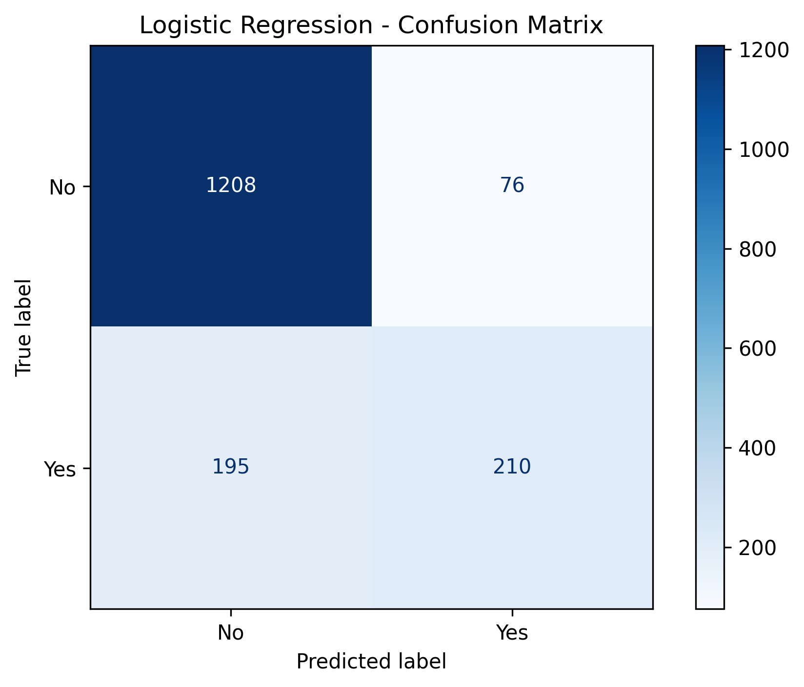
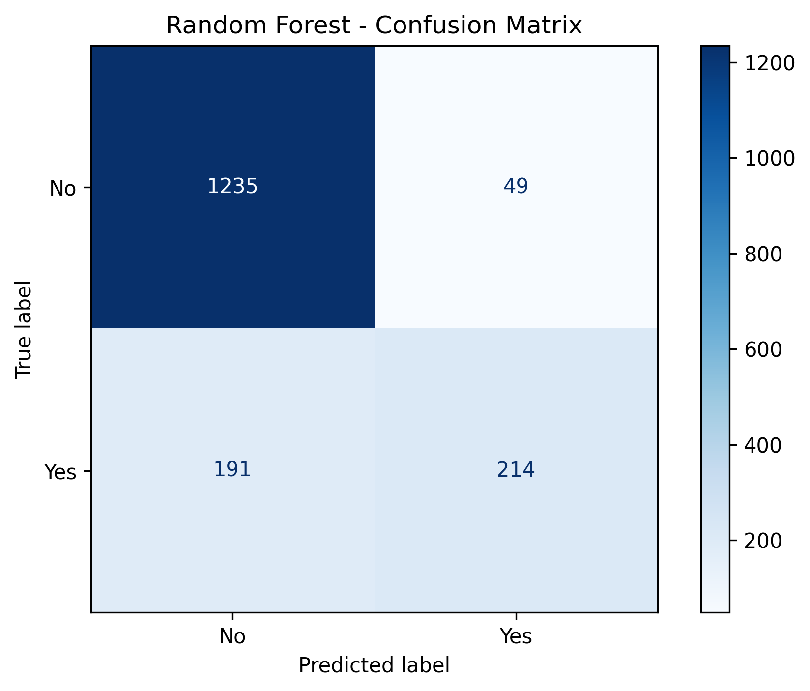
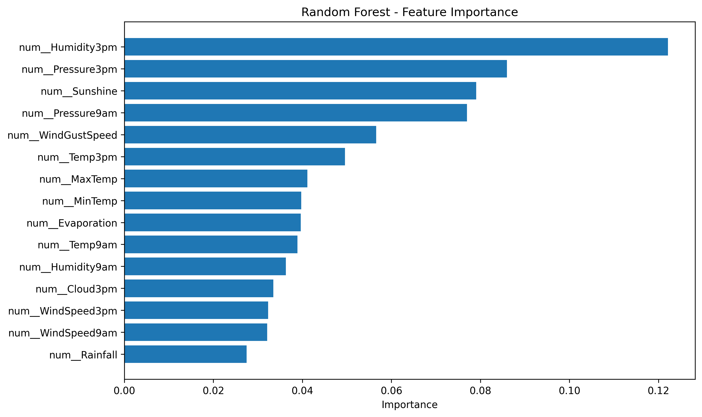

<div align="center">

# 🌦️ Australian Rainfall Prediction

### Binary classification of next-day rainfall using historical Australian weather observations

[](https://www.python.org/)
[](https://scikit-learn.org/)
[](https://pandas.pydata.org/)
[](https://matplotlib.org/)
[](.)

**A modular end-to-end machine learning project for predicting whether rainfall will occur on the following day.**

</div>

---

## 📌 Overview

Weather prediction is a natural machine learning problem involving a mixture of numerical measurements, categorical observations, missing data, seasonal patterns, and class imbalance.

This project builds a **binary classification pipeline** that learns from historical weather observations and predicts:

| Prediction | Meaning |
|---|---|
| `No` | No rain is expected on the following day |
| `Yes` | Rain is expected on the following day |

The implementation compares **Logistic Regression** and **Random Forest**, uses **GridSearchCV** for hyperparameter selection, and evaluates the resulting models using accuracy, precision, recall, F1-score, and confusion matrices.

---

## 🎯 Objective

Build a reliable and reusable classification workflow that can:

- preprocess mixed numerical and categorical weather data
- handle missing feature values without discarding otherwise useful observations
- capture seasonal information from the observation date
- compare a linear classifier with a nonlinear ensemble model
- select model hyperparameters using cross-validation
- analyze both overall performance and rainfall-specific performance
- interpret the trained Random Forest using feature importance

---

## 📊 Dataset

The project uses the **Australian weather (`weatherAUS`) dataset**, containing daily observations from multiple Australian weather stations. The dataset's `RainTomorrow` variable represents whether rain occurred on the following day. The underlying observations come from the Australian Bureau of Meteorology.

The implementation focuses on:

```text
Melbourne
MelbourneAirport
Watsonia
```

### Core input features

| Feature | Description |
|---|---|
| `Location` | Weather station location |
| `MinTemp` | Minimum temperature |
| `MaxTemp` | Maximum temperature |
| `Rainfall` | Rainfall amount |
| `Evaporation` | Evaporation measurement |
| `Sunshine` | Sunshine duration |
| `WindGustDir` | Direction of strongest wind gust |
| `WindGustSpeed` | Speed of strongest wind gust |
| `WindDir9am` | Wind direction at 9 AM |
| `WindDir3pm` | Wind direction at 3 PM |
| `WindSpeed9am` | Wind speed at 9 AM |
| `WindSpeed3pm` | Wind speed at 3 PM |
| `Humidity9am` | Humidity at 9 AM |
| `Humidity3pm` | Humidity at 3 PM |
| `Pressure9am` | Atmospheric pressure at 9 AM |
| `Pressure3pm` | Atmospheric pressure at 3 PM |
| `Cloud9am` | Cloud cover at 9 AM |
| `Cloud3pm` | Cloud cover at 3 PM |
| `Temp9am` | Temperature at 9 AM |
| `Temp3pm` | Temperature at 3 PM |
| `RainToday` | Whether rain was recorded on the observation day |
| `Month` | Month extracted from the observation date |

### Target

```text
RainTomorrow
```

---

## 🧠 Machine Learning Approach

The workflow follows a structured preprocessing → training → evaluation pipeline:

```text
                    Australian Weather Data
                              │
                              ▼
                     Select target features
                              │
                              ▼
                      Filter locations
                              │
                              ▼
                    Date feature engineering
                              │
                              ▼
                      Train / Test Split
                              │
                 ┌────────────┴────────────┐
                 ▼                         ▼
          Numerical Features        Categorical Features
                 │                         │
                 ▼                         ▼
          Median Imputation        Most-Frequent Imputation
                 │                         │
                 ▼                         ▼
          StandardScaler            One-Hot Encoding
                 │                         │
                 └────────────┬────────────┘
                              ▼
                        Model Pipeline
                              │
                 ┌────────────┴────────────┐
                 ▼                         ▼
       Logistic Regression         Random Forest
                 │                         │
                 └────────────┬────────────┘
                              ▼
                         GridSearchCV
                              │
                              ▼
                         Evaluation
```

---

## 🧹 Data Preprocessing

The dataset contains missing values across several weather measurements.

The implementation deliberately treats missing **features** differently from a missing **target**:

```text
Missing RainTomorrow
        ↓
      Drop row

Missing feature value
        ↓
      Impute
```

A supervised learning example must have a known target, while a row can still be useful when one or more input measurements are unavailable.

### Numerical pipeline

```text
SimpleImputer(strategy="median")
            ↓
       StandardScaler
```

### Categorical pipeline

```text
SimpleImputer(strategy="most_frequent")
            ↓
      OneHotEncoder
```

All preprocessing is contained inside the training pipeline, preventing preprocessing statistics from being calculated using the test set.

---

## 🗓️ Feature Engineering

The raw `Date` column is converted into a datetime representation and the month is extracted:

```python
dataframe["Date"] = pd.to_datetime(dataframe["Date"])
dataframe["Month"] = dataframe["Date"].dt.month
```

The model is therefore given seasonal information as an input feature and can learn relationships from historical data rather than being given a manually defined rule such as "winter means rain."

The original `Date` column is not passed directly to the classifier.

---

## 🤖 Models

### Logistic Regression

Logistic Regression is used as a strong, interpretable baseline for binary classification.

Search space:

```text
penalty:
    l1
    l2

solver:
    liblinear

class_weight:
    None
    balanced
```

Best configuration:

```text
penalty      = l1
solver       = liblinear
class_weight = None
```

---

### 🌲 Random Forest

Random Forest is used to model nonlinear relationships and interactions between weather variables.

Search space:

```text
n_estimators:
    50
    100

max_depth:
    None
    10
    20

min_samples_split:
    2
    5
```

Best configuration:

```text
n_estimators      = 100
max_depth         = 20
min_samples_split = 2
```

---

## 🔬 Model Selection

Both models are trained using:

```text
GridSearchCV
5-fold cross-validation
Stratified train/test split
Accuracy as the search metric
```

This provides a consistent comparison while selecting the best hyperparameter combination from the defined search spaces.

---

## 📈 Results

The final workflow produced:

| Dataset Split | Samples |
|---|---:|
| Training | **6,754** |
| Testing | **1,689** |
| Input Features | **22** |

### Model comparison

| Model | Accuracy | Macro F1 | Rain Precision | Rain Recall | Rain F1 |
|---|---:|---:|---:|---:|---:|
| Logistic Regression | **83.96%** | 0.75 | 0.73 | 0.52 | 0.61 |
| **Random Forest 🏆** | **85.79%** | **0.78** | **0.81** | **0.53** | **0.64** |

### Best overall model

**Random Forest** is the strongest model in the current experiment.

It improves on Logistic Regression in:

- overall accuracy
- macro F1
- rain precision
- rain F1

The main remaining challenge is rainfall recall: the model correctly identifies about **53% of the actual rainy cases** in the test set.

---

## 📊 Confusion Matrices

### Logistic Regression

|  | Predicted No | Predicted Yes |
|---|---:|---:|
| **Actual No** | **1208** | 76 |
| **Actual Yes** | 195 | **210** |



### Random Forest

|  | Predicted No | Predicted Yes |
|---|---:|---:|
| **Actual No** | **1235** | 49 |
| **Actual Yes** | 191 | **214** |



### What the matrices show

For Random Forest:

```text
True Positives  = 214
False Positives = 49
False Negatives = 191
True Negatives  = 1235
```

The dominant error is **false negatives**: actual rainy days that the model predicts as non-rain. This explains why overall accuracy can be strong while recall for the rain class remains much lower.

---

## ⭐ Random Forest Feature Importance

The trained Random Forest identifies the following variables among its strongest contributors:

1. **Humidity3pm**
2. **Pressure3pm**
3. **Sunshine**
4. **Pressure9am**
5. **WindGustSpeed**
6. **Temp3pm**
7. **MaxTemp**
8. **MinTemp**



These importances describe how useful the transformed input features were for the Random Forest's decision process. They should be interpreted as model-specific importance measures, not as causal relationships.

---

## 🏗️ Project Structure

```text
Australian-Rainfall-Prediction/
│
├── main.py
├── README.md
├── requirements.txt
├── .gitignore
│
├── src/
│   ├── __init__.py
│   ├── config.py
│   ├── data_loader.py
│   ├── preprocessing.py
│   ├── feature_engineering.py
│   ├── trainer.py
│   ├── evaluator.py
│   └── visualizer.py
│
└── outputs/
    ├── logistic_regression_confusion_matrix.png
    ├── random_forest_confusion_matrix.png
    └── random_forest_feature_importance.png
```

### Module responsibilities

| Module | Responsibility |
|---|---|
| `config.py` | Dataset paths, locations, model grids, and experiment configuration |
| `data_loader.py` | Load the dataset |
| `preprocessing.py` | Target selection, train/test split, imputation, scaling, and encoding |
| `feature_engineering.py` | Date conversion and month extraction |
| `trainer.py` | Build pipelines and perform GridSearchCV |
| `evaluator.py` | Predictions, accuracy, classification report, and confusion matrix |
| `visualizer.py` | Confusion matrix and feature-importance plots |
| `main.py` | End-to-end orchestration |

---

## ⚙️ Installation

Create and activate the project environment:

```powershell
python -m venv .venv
.\.venv\Scripts\Activate.ps1
```

Install dependencies:

```powershell
pip install -r requirements.txt
```

---

## ▶️ Run

From inside the project directory:

```powershell
python main.py
```

Or from the workspace root:

```powershell
python .\12-Rainfall-Prediction\main.py
```

The program trains both models, performs hyperparameter search, prints the evaluation results, and produces the visual analysis.

---

## 💻 Tech Stack

| Area | Technology |
|---|---|
| Language | Python |
| Data manipulation | Pandas |
| Machine learning | Scikit-learn |
| Visualization | Matplotlib |
| Classification | Logistic Regression, Random Forest |
| Preprocessing | SimpleImputer, StandardScaler, OneHotEncoder |
| Pipeline | ColumnTransformer, Pipeline |
| Model selection | GridSearchCV |
| Version control | Git / GitHub |

---

## 💡 Key Learnings

### Machine Learning

- Binary classification
- Train/test splitting
- Stratification
- Class imbalance
- Cross-validation
- Hyperparameter tuning
- Model comparison

### Preprocessing

- Numerical imputation
- Categorical imputation
- Standardization
- One-hot encoding
- ColumnTransformer
- Leakage-safe preprocessing pipelines

### Model Interpretation

- Confusion matrices
- Precision, recall, and F1-score
- Class-specific performance
- Random Forest feature importance

### Engineering

- Modular Python project structure
- Configuration-driven experiments
- Reusable preprocessing and training components
- Separation of loading, preprocessing, training, evaluation, and visualization

---

## ⚠️ Limitations

The current implementation should be interpreted within the scope of this experiment.

- The data is restricted to three selected weather stations.
- The current GridSearchCV objective is **accuracy**, despite the class imbalance.
- Rain-class recall is still relatively low.
- Random Forest feature importance is not causal explanation.
- The evaluation uses a standard stratified train/test split rather than a dedicated chronological forecasting validation scheme.
- Results represent this particular dataset configuration and hyperparameter search; they are not guaranteed future performance.

---

## 🚀 Future Improvements

Potential improvements include:

- optimize model selection for **rain recall, F1, or ROC-AUC**
- tune the probability threshold to reduce missed rainy days
- investigate class-weighted models
- test gradient-boosting approaches such as XGBoost
- introduce chronological or rolling-window validation
- engineer lag and rolling weather features
- expand geographic coverage

---

## 📚 Dataset & References

The `weatherAUS` dataset is described as daily weather observations from multiple Australian weather stations, with `RainTomorrow` representing whether rain occurred on the following day.

- [weatherAUS dataset description](https://www.rdocumentation.org/packages/rattle/versions/5.5.1/topics/weatherAUS)
- [Australian Bureau of Meteorology — Data Services](https://www.bom.gov.au/resources/data-services)

---

## 👨‍💻 Author

**Ayushman Singh**  
Computer Science & Engineering Student  
Sikkim Manipal Institute of Technology

[GitHub — @ayushman652](https://github.com/ayushman652)

---

<div align="center">

### 🌧️ From weather observations to rainfall predictions

**Data → Feature Engineering → Preprocessing → Model Selection → Evaluation → Interpretation**

</div>
